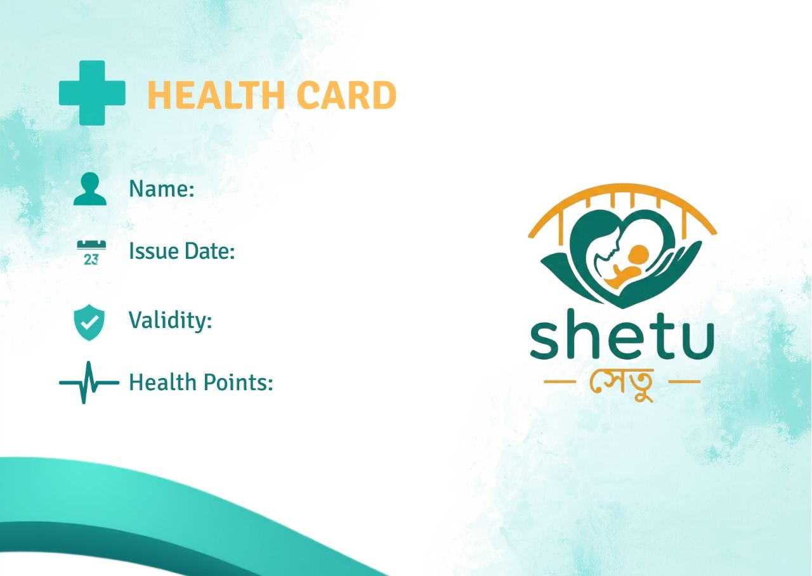

<div align="center">
  

  # Shetu — সেতু
  ### The AI Care Bridge

  [](https://nextjs.org/)
  [](https://fastapi.tiangolo.com/)
  [](https://supabase.com/)
  [](https://www.typescriptlang.org/)
  [](https://www.python.org/)
  [](LICENSE)

</div>

---

**Shetu** is a maternal & general-health companion platform that pairs a FastAPI
backend with a Next.js frontend. It started as a simple auth microservice and
has grown into a full health-tracking + AI-assistant suite for two user roles:

- **🤰 Mother** — pregnancy tracking, ANC vitals, maternal health reports, gynecologist search, maternal blog
- **🧑‍⚕️ Patient** — general vitals tracking, daily check-ins, health goals, AI risk prediction, telemedicine, health blog

Both roles share a central AI chatbot ("Saathi"), authentication, profile
management, a digital health card, and PDF report generation — all backed by Supabase.

---

## Table of Contents

- [Features](#features)
- [Branding](#branding)
- [Tech Stack](#tech-stack)
- [Project Structure](#project-structure)
- [Prerequisites](#prerequisites)
- [Supabase Setup](#supabase-setup)
- [Quick Start](#quick-start)
- [Environment Variables](#environment-variables)
- [API Reference](#api-reference)
- [Available Scripts](#available-scripts)
- [Auth Flow](#auth-flow)
- [License](#license)

---

## Features

- **Authentication** — Supabase-backed signup/signin/email verification with role-based profiles (`admin`, `mother`, `patient`)
- **Profile & Account** — profile creation/summary, avatar upload, account settings
- **Digital Health Card** — a shareable Shetu Health Card showing name, issue date, 1-year validity, and earned health points
- **Vitals tracking** — log & view vitals history, trends, and stats (separate flows for patient vs. mother/ANC)
- **Daily check-ins** — patient mood/symptom check-ins with weekly summaries
- **Health goals** — create, track, and mark goals as achieved
- **AI Health Reports** — Gemini/OpenRouter-powered analysis generating downloadable PDF reports (patient & maternal variants)
- **AI Health Assistant (Saathi)** — conversational chatbot for health questions, with optional lab-value input
- **Risk prediction** — AI-assisted health risk insights
- **Doctor / consultancy search** — BMDC-sourced doctor directory, specialties, telemedicine, and emergency contacts (general + gynecologist-specific for mothers)
- **Health blog** — auto-fetched & cached articles from WHO/CDC/NHS RSS feeds, with bookmarking, synced to Supabase on a schedule, and verified working source links
- **Nutrition & Rewards modules** — daily plans, streaks, shields, and a nutrient passport on the dashboard
- **Flag detection** — automatic vital-sign flagging rules for both patient and maternal contexts

---

## Branding

Shetu's identity is the teal hand-and-heart mark paired with the **shetu / সেতু**
wordmark, used across the favicon, sign-in/sign-up screens, and dashboard headers.

<div align="center">
  
</div>

The **Shetu Health Card** (`src/components/shared/HealthCard.tsx`) is a reusable
component shown in the Rewards and Nutrition modules for both roles. It displays
the user's name, issue date, a 1-year validity (computed from the issue date),
and their current health points, styled with the brand teal (`#0E7C66`) and
amber (`#F2A33D`) accents.

<div align="center">
  
</div>

---

## Tech Stack

| Layer | Technology |
| --- | --- |
| Frontend | Next.js 14 (App Router), TypeScript, Tailwind CSS, Framer Motion, React Hook Form + Zod |
| Backend | FastAPI (Python 3.11+), Pydantic v2, Uvicorn |
| Database / Auth | Supabase (Postgres, Auth, Storage) |
| AI | Google Gemini (`google-generativeai`), OpenRouter (fallback chain) |
| PDF generation | ReportLab |
| Scheduling | APScheduler (background blog fetch/sync) |
| Scraping | BeautifulSoup, feedparser, httpx/requests |

---

## Project Structure

```
SHETU/
├── app_logo.png                      # Brand mark (used in this README)
├── health_card.jpg                   # Health Card design reference
├── database/                         # SQL schema / migration references
├── services/
│   └── setu-auth/
│       ├── backend/
│       │   ├── app/
│       │   │   ├── main.py                  # FastAPI app, CORS, routers, scheduler, error handlers
│       │   │   ├── core/
│       │   │   │   ├── config.py            # Pydantic settings from .env
│       │   │   │   ├── auth.py              # JWT/token verification helpers
│       │   │   │   ├── deps.py              # FastAPI dependencies (current user, etc.)
│       │   │   │   └── supabase.py          # admin client + create_anon_client()
│       │   │   ├── models/                  # Pydantic request/response models
│       │   │   ├── routes/
│       │   │   │   ├── auth.py              # /api/v1/auth — signup, signin, me
│       │   │   │   ├── profile.py           # /api/v1/profile
│       │   │   │   ├── account.py           # /api/v1/account
│       │   │   │   ├── vitals.py            # /api/v1/vitals (patient)
│       │   │   │   ├── checkin.py           # /api/v1/checkin (patient)
│       │   │   │   ├── goals.py             # /api/v1/goals (patient)
│       │   │   │   ├── reports.py           # /api/v1/reports (patient AI reports)
│       │   │   │   ├── consultancy.py       # /api/v1/doctors (patient)
│       │   │   │   ├── blog.py              # /api/v1/blog (patient)
│       │   │   │   ├── chat.py              # /api/v1/chat (Saathi assistant)
│       │   │   │   ├── mother_vitals.py     # /api/v1/mother/vitals (ANC)
│       │   │   │   ├── mother_reports.py    # /api/v1/mother/reports (maternal AI reports)
│       │   │   │   ├── mother_doctors.py    # /api/v1/mother/doctors (gynecologists)
│       │   │   │   └── mother_blog.py       # /api/v1/mother/blog
│       │   │   └── services/                # Gemini/OpenRouter, PDF, BMDC, blog fetcher, flag rules
│       │   ├── generated_reports/           # Output PDFs (gitignored content)
│       │   ├── requirements.txt
│       │   ├── .env.example
│       │   └── start.ps1                    # Windows venv bootstrap + run
│       ├── frontend/
│       │   ├── public/
│       │   │   ├── images/logo.png          # Brand logo used across the app
│       │   │   ├── favicon.ico
│       │   │   └── icon.png
│       │   ├── src/
│       │   │   ├── app/
│       │   │   │   ├── auth/                # signin / signup / callback
│       │   │   │   └── dashboard/
│       │   │   │       ├── mother/          # mother dashboard + Saathi modules
│       │   │   │       └── patient/         # patient dashboard + Saathi modules
│       │   │   ├── components/
│       │   │   │   ├── shared/
│       │   │   │   │   ├── HealthCard.tsx       # Reusable digital Health Card
│       │   │   │   │   ├── RewardsModule.tsx    # Streaks, shields, nutrient passport
│       │   │   │   │   ├── NutritionModule.tsx  # Nutrition plans + Health Card
│       │   │   │   │   └── CentralChatbot/      # shared AI chatbot UI
│       │   │   │   └── mother/                  # mother-specific components (BottomNav, etc.)
│       │   │   ├── hooks/                   # voice input/output, chatbot context
│       │   │   └── lib/                     # Supabase clients, API wrapper, domain helpers
│       │   ├── package.json
│       │   └── .env.local.example
│       ├── Makefile                          # WSL/Linux task runner
│       └── start-backend.ps1 / start-frontend.ps1 / start-dev.ps1   # Windows launchers
└── README.md
```

---

## Prerequisites

- **Node.js 18+**
- **Python 3.11+**
- A **Supabase** project
- (Optional) A **Gemini API key** and/or **OpenRouter API key** for AI features

---

## Supabase Setup

The app expects at least the following schema. Run these in the Supabase **SQL Editor**.

### `profiles` table + signup trigger

```sql
create type user_role as enum ('admin', 'mother', 'patient');

create table public.profiles (
  id         uuid primary key references auth.users (id) on delete cascade,
  role       user_role not null default 'patient',
  full_name  text not null,
  phone      text,
  created_at timestamptz not null default now(),
  updated_at timestamptz not null default now()
);

create or replace function public.handle_new_auth_user()
returns trigger
language plpgsql
security definer
set search_path = public
as $$
begin
  insert into public.profiles (id, role, full_name, phone)
  values (
    new.id,
    coalesce((new.raw_user_meta_data ->> 'role')::user_role, 'patient'),
    coalesce(new.raw_user_meta_data ->> 'full_name', ''),
    new.raw_user_meta_data ->> 'phone'
  );
  return new;
end;
$$;

create trigger on_auth_user_created
  after insert on auth.users
  for each row execute function public.handle_new_auth_user();
```

Also enable **email confirmation** under
*Authentication → Sign In / Providers → Email* so users receive a verification
email after signup.

> The Saathi modules (vitals, check-ins, goals, reports, blog, doctors) read
> and write additional tables (`vitals`, `checkins`, `goals`, `reports`,
> `health_articles`, `article_bookmarks`, `doctor_chambers`, mother-equivalents, etc.) via the
> `service_role` key — these are created/managed as the app evolves.

---

## Quick Start

### WSL / Linux / macOS

```bash
# 1. Copy env files and fill in your keys
cp services/setu-auth/backend/.env.example services/setu-auth/backend/.env
cp services/setu-auth/frontend/.env.local.example services/setu-auth/frontend/.env.local

# 2. Install dependencies (backend venv + frontend node_modules)
cd services/setu-auth && make install

# 3. Run both services
make dev
```

### Windows (PowerShell)

```powershell
# 1. Copy env files and fill in your keys
Copy-Item services\setu-auth\backend\.env.example services\setu-auth\backend\.env
Copy-Item services\setu-auth\frontend\.env.local.example services\setu-auth\frontend\.env.local

# 2. Install deps (creates backend\.venv-win on first run)
cd services\setu-auth
make win-install

# 3. Run both services in separate windows
.\start-dev.ps1
```

- Backend → http://localhost:8000 (interactive docs at `/docs`)
- Frontend → http://localhost:3000

### Where to get the keys

| Variable | Supabase location |
| --- | --- |
| `SUPABASE_URL` / `NEXT_PUBLIC_SUPABASE_URL` | Project Settings → API → Project URL |
| `SUPABASE_ANON_KEY` / `NEXT_PUBLIC_SUPABASE_ANON_KEY` | Project Settings → API → `anon` public key |
| `SUPABASE_SERVICE_ROLE_KEY` | Project Settings → API → `service_role` secret key |

> ⚠️ The `service_role` key is backend-only. Never expose it to the browser.

---

## Environment Variables

### `backend/.env`

| Variable | Required | Description |
| --- | --- | --- |
| `SUPABASE_URL` | ✅ | Supabase project URL |
| `SUPABASE_SERVICE_ROLE_KEY` | ✅ | Service-role key (admin operations) |
| `SUPABASE_ANON_KEY` | ✅ | Public anon key |
| `ALLOWED_ORIGINS` | – | Comma-separated CORS origins (default `http://localhost:3000`) |
| `PORT` | – | Backend port (default `8000`) |
| `GEMINI_API_KEY` | – | Enables Gemini-powered chat & report analysis |
| `OPENROUTER_API_KEY` | – | Fallback model chain for AI analysis |
| `BMDC_API_BASE` | – | Base URL for BMDC doctor lookups |
| `WHO_RSS_URL` / `CDC_RSS_URL` / `NHS_RSS_URL` | – | RSS sources for the health blog |
| `REPORT_STORAGE_PATH` | – | Local directory for generated PDF reports (default `./generated_reports`) |

### `frontend/.env.local`

| Variable | Required | Description |
| --- | --- | --- |
| `NEXT_PUBLIC_SUPABASE_URL` | ✅ | Supabase project URL |
| `NEXT_PUBLIC_SUPABASE_ANON_KEY` | ✅ | Public anon key |
| `NEXT_PUBLIC_API_URL` | ✅ | Backend base URL (default `http://localhost:8000`) |
| `NEXT_PUBLIC_SITE_URL` | – | Frontend origin used for signup confirmation-email redirects |
| `NEXT_PUBLIC_GEMINI_API_KEY` | – | Used by client-side AI helpers |
| `NEXT_PUBLIC_OPENROUTER_API_KEY` | – | Fallback for client-side AI helpers |

---

## API Reference

All `4xx`/`5xx` responses use the shape `{ "detail": "…" }`. Endpoints marked
**Auth** require an `Authorization: Bearer <access_token>` header.

### Health

| Method | Path | Auth | Description |
| --- | --- | --- | --- |
| `GET` | `/health` | – | Liveness check |

### Auth — `/api/v1/auth`

| Method | Path | Auth | Description |
| --- | --- | --- | --- |
| `POST` | `/signup` | – | Create user via Supabase admin API; sends verification email |
| `POST` | `/signin` | – | Sign in with email + password; returns `access_token` + profile |
| `GET` | `/me` | ✅ | Return the current user's profile |

### Profile & Account

| Method | Path | Auth | Description |
| --- | --- | --- | --- |
| `GET` / `POST` / `PATCH` | `/api/v1/profile` | ✅ | Get / create / update the user's profile |
| `GET` | `/api/v1/profile/summary` | ✅ | Profile summary widget data |
| `GET` / `PUT` | `/api/v1/account` | ✅ | Get / update account settings |
| `POST` | `/api/v1/account/avatar` | ✅ | Upload avatar (base64) |

### Patient — Vitals, Check-ins, Goals

| Method | Path | Auth | Description |
| --- | --- | --- | --- |
| `POST` | `/api/v1/vitals/log` | ✅ | Log a vitals entry |
| `GET` | `/api/v1/vitals/history` | ✅ | Vitals history |
| `GET` | `/api/v1/vitals/latest` | ✅ | Most recent vitals |
| `GET` | `/api/v1/vitals/trends` | ✅ | Trend data for charts |
| `GET` | `/api/v1/vitals/stats` | ✅ | Aggregate stats |
| `POST` | `/api/v1/checkin` | ✅ | Submit a daily check-in |
| `GET` | `/api/v1/checkin/today` | ✅ | Today's check-in |
| `GET` | `/api/v1/checkin/history` | ✅ | Check-in history |
| `GET` | `/api/v1/checkin/weekly-summary` | ✅ | Weekly summary |
| `POST` | `/api/v1/goals` | ✅ | Create a goal |
| `GET` | `/api/v1/goals` | ✅ | List goals |
| `PATCH` | `/api/v1/goals/{goal_id}` | ✅ | Update a goal |
| `DELETE` | `/api/v1/goals/{goal_id}` | ✅ | Delete a goal |
| `POST` | `/api/v1/goals/{goal_id}/achieve` | ✅ | Mark a goal as achieved |

### Patient — Reports, Chat, Doctors, Blog

| Method | Path | Auth | Description |
| --- | --- | --- | --- |
| `POST` | `/api/v1/reports/generate` | ✅ | Generate an AI health report (PDF) |
| `GET` | `/api/v1/reports/history` | ✅ | List generated reports |
| `GET` | `/api/v1/reports/{report_id}` | ✅ | Report metadata |
| `GET` | `/api/v1/reports/{report_id}/pdf` | ✅ | Download report PDF |
| `POST` | `/api/v1/chat` | ✅ | Saathi AI health-assistant chat |
| `GET` | `/api/v1/doctors/search` | ✅ | Search doctors |
| `GET` | `/api/v1/doctors/specialties` | ✅ | List specialties |
| `GET` | `/api/v1/doctors/telemedicine` | ✅ | Telemedicine providers |
| `GET` | `/api/v1/doctors/emergency` | ✅ | Emergency contacts |
| `GET` | `/api/v1/blog/articles` | ✅ | List blog articles (live WHO/CDC/NHS feed + cache) |
| `GET` | `/api/v1/blog/featured` | ✅ | Featured articles |
| `GET` | `/api/v1/blog/articles/{slug}` | ✅ | Article detail (includes `source_url`) |
| `GET` | `/api/v1/blog/bookmarks` | ✅ | List bookmarked articles |
| `POST` | `/api/v1/blog/articles/{article_id}/bookmark` | ✅ | Bookmark an article |
| `DELETE` | `/api/v1/blog/articles/{article_id}/bookmark` | ✅ | Remove bookmark |

### Mother — Vitals, Reports, Doctors, Blog

| Method | Path | Auth | Description |
| --- | --- | --- | --- |
| `POST` | `/api/v1/mother/vitals/log` | ✅ | Log ANC vitals |
| `GET` | `/api/v1/mother/vitals/history` | ✅ | ANC vitals history |
| `GET` | `/api/v1/mother/vitals/latest` | ✅ | Most recent ANC vitals |
| `GET` | `/api/v1/mother/vitals/trends` | ✅ | Trend data |
| `GET` | `/api/v1/mother/vitals/anc-summary` | ✅ | ANC summary |
| `POST` | `/api/v1/mother/reports/generate` | ✅ | Generate maternal AI health report (PDF) |
| `GET` | `/api/v1/mother/reports/history` | ✅ | List generated reports |
| `GET` | `/api/v1/mother/reports/{report_id}` | ✅ | Report metadata |
| `GET` | `/api/v1/mother/reports/{report_id}/pdf` | ✅ | Download report PDF |
| `GET` | `/api/v1/mother/doctors/search` | ✅ | Search gynecologists |
| `GET` | `/api/v1/mother/doctors/telemedicine` | ✅ | Telemedicine providers |
| `GET` | `/api/v1/mother/doctors/emergency` | ✅ | Maternal emergency contacts |
| `GET` | `/api/v1/mother/blog/articles` | ✅ | List blog articles (filtered for maternal topics) |
| `GET` | `/api/v1/mother/blog/articles/{slug}` | ✅ | Article detail (includes `source_url`) |
| `GET` | `/api/v1/mother/blog/featured` | ✅ | Featured articles |
| `GET` | `/api/v1/mother/blog/bookmarks` | ✅ | List bookmarked articles |
| `POST` | `/api/v1/mother/blog/articles/{article_id}/bookmark` | ✅ | Bookmark an article |
| `DELETE` | `/api/v1/mother/blog/articles/{article_id}/bookmark` | ✅ | Remove bookmark |

> Full request/response schemas are available via the interactive Swagger UI
> at `/docs` once the backend is running.

---

## Available Scripts

### Makefile (WSL/Linux/macOS)

| Command | Description |
| --- | --- |
| `make install` | Install backend (venv) + frontend (`npm install`) deps |
| `make dev` | Run backend and frontend together |
| `make backend` | Run FastAPI on port 8000 (kills any existing instance first) |
| `make frontend` | Run Next.js on port 3000 |
| `make lint` | Syntax-check backend, lint frontend |
| `make clean` | Remove caches and build artifacts |
| `make env-setup` | Copy `.env.example` files |

### Windows PowerShell

| Command | Description |
| --- | --- |
| `.\start-backend.ps1` | Bootstrap `.venv-win` (first run) and start FastAPI |
| `.\start-frontend.ps1` | Start Next.js |
| `.\start-dev.ps1` | Open both in separate PowerShell windows |
| `make win-install` | Create Windows venv + install all deps |
| `make win-dev` | Same as `start-dev.ps1`, via Make |

---

## Auth Flow

1. **Signup** — frontend posts to the backend, which calls
   `auth.admin.create_user(..., email_confirm=False)`. The DB trigger inserts
   a `profiles` row; Supabase emails a verification link.
2. **Verify** — user clicks the email link.
3. **Signin** — frontend posts to the backend, which calls
   `sign_in_with_password`, fetches the profile, and returns an
   `access_token`. The frontend stores `shetu_token` / `shetu_user` in
   `localStorage`.
4. **Dashboard** — role-based redirect to `/dashboard/mother` or
   `/dashboard/patient`. Protected routes check `localStorage` for
   `shetu_token` and redirect to `/auth/signin` if absent. Subsequent API
   calls send `Authorization: Bearer <access_token>`, validated by the backend
   against Supabase.

---

## License

This project is licensed under the [MIT License](LICENSE).
